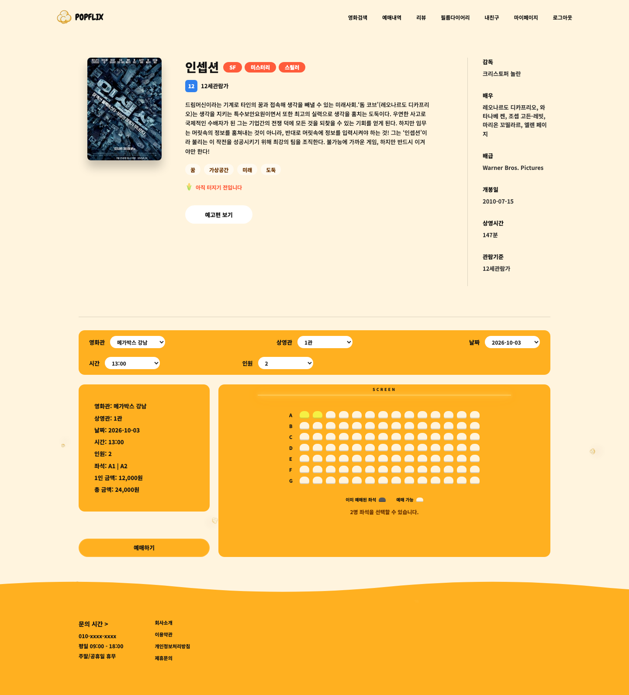
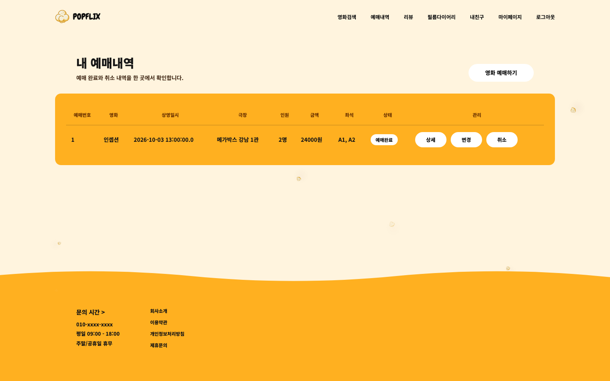
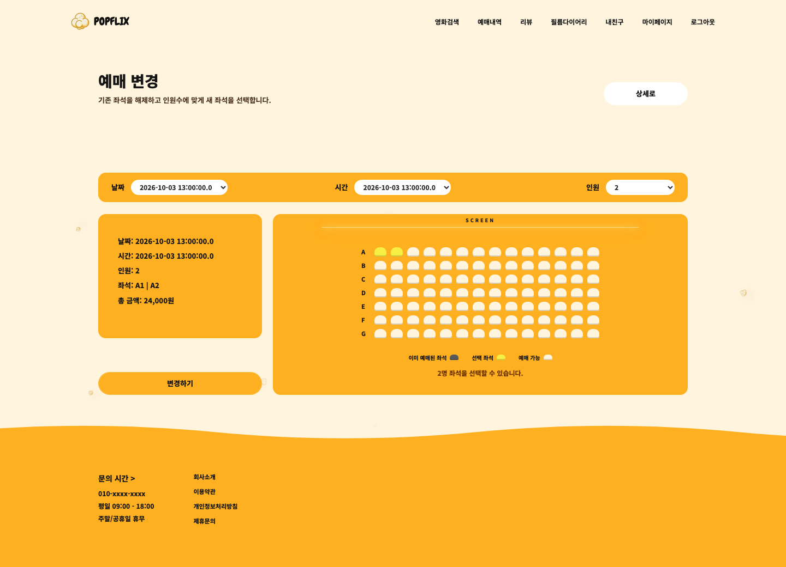
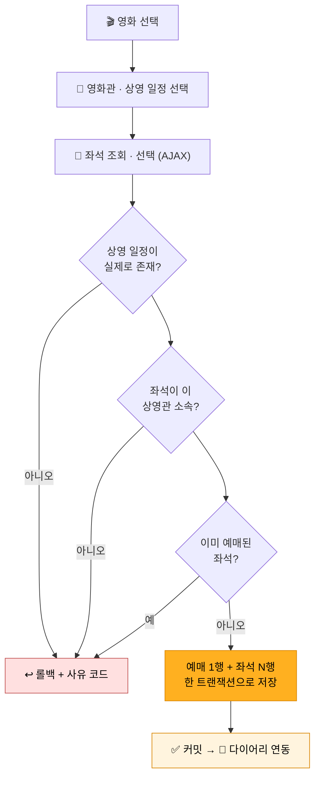
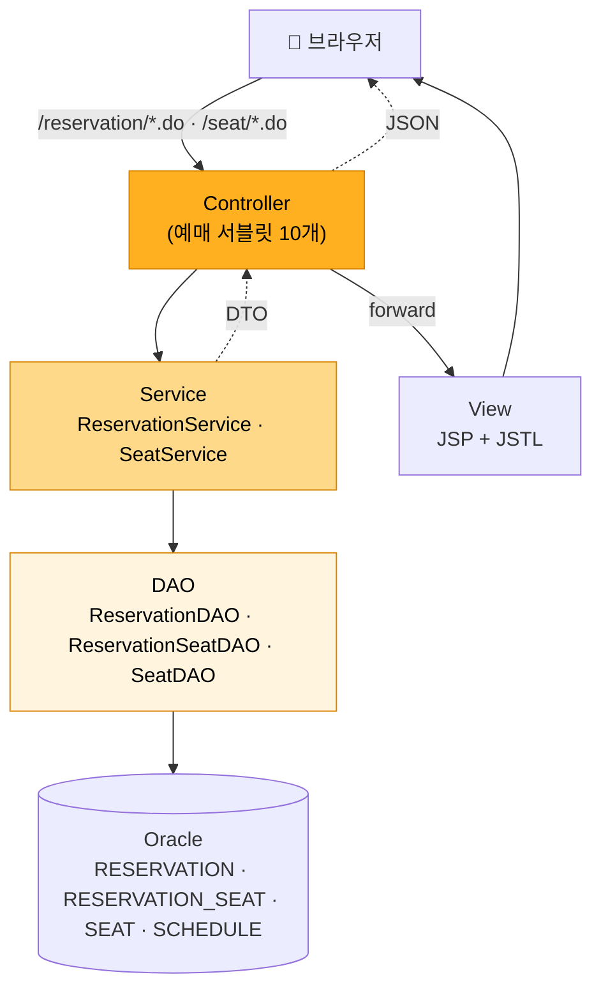

<h1 align="center">🍿 POPFLIX</h1>

<h3 align="center">영화 탐색부터 좌석 선택, 예매 관리까지 — 예매 흐름을 책임진 영화 예매 서비스</h3>

<br/>

> 영화 선택 → 상영 일정 → 좌석 선택 → 검증 → 예매 확정 → 변경 · 취소.<br/>
> **프레임워크 없이 Servlet/JSP MVC2를 직접 구성.** 예매 서블릿 10개 · JDBC 수동 트랜잭션 · 로컬 Tomcat 구동.

<br/>

## 프로젝트 개요

**왜 만들었나** — 영화 예매는 사용자·관리자·좌석 재고·외부 API가 모두 얽히는 대표적인 웹 서비스 모델.
기능별 역할 분리가 명확해 MVC 패턴을 익히기에 적합하다고 판단해 팀 주제로 선정.

**왜 프레임워크 없이 MVC2인가** — Spring이 대신해 주는 요청 분배·트랜잭션 관리를 직접 만들어 보기 위해.
서블릿이 요청을 받아 Service·DAO를 거쳐 JSP로 포워딩하는 경로와, `Connection` 수동 커밋으로 트랜잭션 경계를 손으로 구성.

| | |
| --- | --- |
| **기간 · 인원** | 2026.04.28 – 05.14 · 5인 팀 (에이콘아카데미) |
| **아키텍처** | Servlet/JSP MVC2 — Controller · Service · DAO 3계층 |
| **DB** | Oracle · JDBC (순수) |
| **외부 연동** | KMDb 영화 OpenAPI · 네이버 OAuth2 로그인 |
| **저장소** | 팀 저장소 [Rustapex/JavaServletMVC-Project](https://github.com/Rustapex/JavaServletMVC-Project) · 서비스명 POPFLIX |

**담당 범위** — **조장** · 예매 모듈(영화관·상영 일정·좌석 선택·예매 등록·조회·변경·취소) 설계와 구현.
마이페이지를 포함한 공통 스타일 · 화면 통합과 병합 충돌 정리도 담당. 아래 설명은 이 범위를 다룸.

<br/>

## 주요 기능

| 기능 | 무엇으로 어떻게 구현했나 |
| --- | --- |
| **상영 일정 조회** | 영화 선택 시 `schedule ⋈ screen ⋈ theater` 3-테이블 JOIN으로 영화관·상영관·시간대를 한 번에 조회. 화면은 AJAX로만 갱신 |
| **좌석 선택** | `SeatListServlet`이 상영 일정별 전체 좌석과 예매된 좌석을 내려주고, 화면에서 선택·비활성 처리 |
| **예매 등록** | 예매 1행 + 선택 좌석 N행을 **하나의 JDBC 트랜잭션**으로 저장. 실패 지점별로 음수 코드를 반환해 화면이 사유를 구분 |
| **좌석 변경** | 기존 좌석 삭제 → 새 좌석 등록 → 인원수 갱신을 한 트랜잭션으로 처리. 중복 검사에서 **자기 예매의 좌석은 제외** |
| **예매 취소** | 좌석 점유 행 삭제와 예매 상태 변경(`Y`→`C`)을 함께 처리. 취소한 좌석은 즉시 재예매 가능 |
| **본인 확인** | 조회·변경·취소 쿼리에 `reservation_id` + `member_id`를 함께 바인딩 — 남의 예매는 애초에 조회되지 않음 |
| **다이어리 연동** | 예매 완료 시 `reservation_id`를 넘겨 필름 다이어리 기록이 자동 생성되도록 연결 |

**서비스 전체 기능** — 영화 조회·검색(KMDb) · 리뷰·평점 · 친구 · 필름 다이어리 · 관리자(권한·스케줄·좌석·에러 로그) · 회원가입(SHA-256)과 네이버 소셜 로그인.

<br/>



영화 상세에서 영화관·상영관·날짜·시간·인원을 고르면 좌석 배치도가 갱신되고, 이미 예매된 좌석은 선택할 수 없습니다.

<details>
<summary><b>실행 화면 더 보기</b> — 예매 내역 · 예매 변경</summary>
<br/>





</details>

<br/>

### 예매 한 건이 저장되기까지



검증은 전부 **저장과 같은 커넥션 안에서** 수행. 어느 단계에서 실패하든 그때까지의 변경이 전부 롤백되어,
"예매는 있는데 좌석이 없는" 반쪽 데이터가 만들어질 수 없는 구조.

> 📄 [`ReservationService.reserve()`](src/main/java/reservation/service/ReservationService.java#L405-L480) — 검증 체인과 트랜잭션 저장 전체

<br/>

## 기술 스택

| 구분 | 사용 | 선택 이유 |
| --- | --- | --- |
| **언어** | Java 17 | 학습 중인 주 언어. 문법보다 기본기(JDBC·컬렉션·예외 처리)에 집중 |
| **웹** | Servlet 4.0 / JSP / JSTL | 프레임워크에 기대기 전에 요청–응답과 MVC의 실제 동작을 확인하려고 MVC2를 직접 구성 |
| **DB** | Oracle (ojdbc8) | 수업에서 다룬 DB. 예매·좌석처럼 함께 변해야 하는 데이터로 트랜잭션을 연습하기에 적합 |
| **DB 접근** | JDBC (순수) | `setAutoCommit(false)`부터 커밋·롤백까지 트랜잭션 경계를 직접 눈으로 확인하려고 |
| **Frontend** | HTML / CSS / JavaScript / AJAX | 좌석 선택·일정 연동처럼 부분 갱신이 필요한 화면은 AJAX로 처리 |
| **외부 API** | KMDb OpenAPI · 네이버 OAuth2 | 영화 데이터 조회 / 소셜 로그인 |
| **서버 · 도구** | Apache Tomcat 9.0 · Eclipse · SQL Developer · Git/GitHub | 팀 공통 개발 환경 |

<br/>

## 실행 방법

**요구 사항** — JDK 17 · Apache Tomcat 9 · Oracle (XE 가능) · Eclipse (Dynamic Web Project)

**1. DB 준비** — Oracle에 스키마(영화·회원·상영·예매·리뷰·다이어리 테이블)를 생성

**2. 설정 파일 작성** — `config.example.properties`를 복사해 값 입력

```bash
cp src/main/resources/config.example.properties src/main/resources/config.properties
```

```properties
DB_DRIVER=oracle.jdbc.OracleDriver
DB_URL=jdbc:oracle:thin:@localhost:1521:XE
DB_USER=your-db-user
DB_PASSWORD=your-db-password

KMDB_SERVICE_KEY=your-kmdb-service-key   # https://www.kmdb.or.kr 에서 무료 발급
NAVER_CLIENT_ID=your-naver-client-id
NAVER_CLIENT_SECRET=your-naver-client-secret
```

> `config.properties`는 `.gitignore` 등록 파일이라 저장소에 올라가지 않음. DB 비밀번호·API 키는 소스에서 분리.

**3. 실행** — Eclipse에서 Dynamic Web Project로 가져온 뒤 Tomcat 9 서버에 올려 구동 → http://localhost:8080

<br/>

## 구조 · 설계

요청을 받는 곳(Controller) · 판정하는 곳(Service) · 저장하는 곳(DAO)을 분리한 3계층 구조.



**왜 트랜잭션을 Service에 모았나** — 예매 저장은 "일정 확인 → 좌석 소속 확인 → 중복 확인 → 예매 저장 → 좌석 저장"
다섯 단계가 한 덩어리. 서블릿에 두면 커넥션 관리가 화면 코드와 섞이고, DAO에 두면 단계 사이의 판정을 넣을 곳이 없음.
커넥션의 수명과 커밋·롤백 판단을 Service 한 곳에 모아, 서블릿은 파라미터 정리와 결과 분기만 담당.

<br/>

| 서블릿 | URL | 하는 일 |
| --- | --- | --- |
| `ReservationFormServlet` | `/reservation/form.do` | 영화관·상영 일정·좌석 선택 화면 |
| `SeatListServlet` | `/seat/list.do` | 상영 일정별 좌석 현황 조회 (AJAX) |
| `SeatCheckServlet` | `/seat/check.do` | 선택 좌석의 예매 가능 여부 확인 |
| `ReservationInsertServlet` | `/reservation/insert.do` | 예매 등록 — Service 트랜잭션 호출, 실패 코드별 분기 |
| `ReservationCompleteServlet` | `/reservation/complete.do` | 예매 완료 화면 + 다이어리 연동 |
| `MyReservationServlet` | `/reservation/myList.do` | 로그인 회원의 예매 목록 |
| `ReservationDetailServlet` | `/reservation/detail.do` | 예매 상세 (본인 확인 후 노출) |
| `ReservationUpdateFormServlet` | `/reservation/updateForm.do` | 좌석 변경 화면 — 기존 선택 좌석 표시 |
| `ReservationUpdateServlet` | `/reservation/update.do` | 좌석 변경 — 삭제 · 재등록 · 인원수 갱신 한 트랜잭션 |
| `ReservationCancelServlet` | `/reservation/cancel.do` | 예매 취소 — 좌석 해제 + 상태 변경 |

<details>
<summary><b>폴더 구조</b> (담당 범위 중심)</summary>

```
src/main/
├── java/
│   ├── reservation/            # ★ 예매 (담당 범위)
│   │   ├── controller/         #   서블릿 10개
│   │   ├── service/            #   ReservationService — 검증 · 트랜잭션
│   │   │                       #   SeatService — 좌석 조회 · 중복 판정
│   │   ├── dao/                #   ReservationDAO · ReservationSeatDAO · SeatDAO
│   │   └── dto/                #   예매 · 좌석 · 일정 · 영화관 DTO
│   ├── common/                 # DBUtil · AppConfig · 필터 · 암호화 유틸
│   ├── member/                 # 회원 · 네이버 OAuth2
│   ├── movie/                  # 영화 조회 · KMDb API
│   ├── review/ friend/         # 리뷰 · 친구
│   ├── diary/                  # 필름 다이어리
│   ├── schedule/ screen/       # 상영 일정 · 상영관
│   └── admin/                  # 관리자
├── resources/
│   └── config.example.properties
└── webapp/
    ├── WEB-INF/views/          # JSP
    └── css/ js/ img/
```

</details>

<br/>

## 트러블슈팅

### 1. 예매는 저장됐는데 좌석이 저장되지 않는 반쪽 데이터

- **문제** — 예매는 `RESERVATION` 1행, 좌석은 `RESERVATION_SEAT` N행으로 나뉘어 저장되는 구조.
  각 DAO가 자기 커넥션으로 따로 저장하면, 좌석 저장이 중간에 실패했을 때 예매 행만 남음.
  목록에는 예매가 보이는데 좌석 현황에는 비어 있는 — 어느 쪽을 믿어야 할지 알 수 없는 상태
- **고려한 선택지**

  | 선택지 | 문제 |
  | --- | --- |
  | ① 실패 시 앞서 저장한 예매를 삭제하는 보상 로직 | 보상 자체가 실패하면 결국 같은 상태. 실패 경로마다 보상 코드 증가 |
  | ② 예매 테이블에 좌석 목록을 문자열 컬럼으로 합침 | 좌석별 중복 검사·점유 해제가 불가능해짐. 정규화 포기 |
  | ③ **하나의 커넥션에서 수동 트랜잭션으로 묶음** | 커넥션 수명 관리를 직접 책임져야 함 |

- **선택** — ③. `setAutoCommit(false)`로 시작해 예매 1행과 좌석 N행을 같은 커넥션으로 저장하고,
  어느 단계에서 실패하든 롤백. 실패 지점별로 `-1`(좌석 미선택) `-2`(중복 좌석) `-3`(예매 저장 실패) `-4`(좌석 저장 실패)를
  반환해 서블릿이 사용자에게 사유를 구분해 안내

  ```java
  // ReservationService.reserve() — 검증 실패든 저장 실패든 전부 같은 롤백 경로
  con.setAutoCommit(false);
  ...
  int reservationId = reservationDAO.insertReservation(con, reservationDTO);
  if (reservationId == 0) { con.rollback(); return -3; }

  for (Integer seatId : seatIds) {
      int result = reservationSeatDAO.insertReservationSeat(con, dto);
      if (result == 0) { con.rollback(); return -4; }
  }
  con.commit();
  ```

- **결과** — 어떤 실패 경로에서도 예매·좌석이 함께 저장되거나 함께 사라짐. 반쪽 데이터 생성 불가
- **배운 점** — "함께 변해야 하는 데이터"의 경계가 곧 트랜잭션의 경계.
  프레임워크의 `@Transactional`이 숨겨 주던 커넥션 수명·커밋 시점을 직접 관리하며 트랜잭션의 실체를 체감

> 📄 [`ReservationService.reserve()`](src/main/java/reservation/service/ReservationService.java#L405-L480)

<br/>

### 2. 좌석 변경이 항상 "이미 예매된 좌석"으로 실패

- **문제** — 좌석 변경 기능을 예매 등록과 같은 중복 검사로 구현했더니, 기존 좌석을 한 자리라도 유지한 채
  변경하면 **내 좌석이 내 변경을 막는** 현상 발생. 예매된 좌석 목록에 변경 대상 예매의 좌석도 포함되어 있었기 때문
- **시도** — ① 중복 검사를 빼고 저장 → 다른 사람 좌석과의 충돌까지 통과되어 더 위험
  ② 화면에서 기존 좌석을 먼저 해제하고 재선택 → 해제와 재등록 사이에 남이 그 좌석을 가져갈 수 있음
- **선택** — 검사 쿼리 자체를 분리. **"현재 예매를 제외한" 예매 좌석**만 중복 대상으로 조회

  ```java
  // ReservationService.updateReservation() — 내 기존 좌석은 중복 검사에서 제외
  ArrayList<Integer> reservedSeatIds = seatService.getReservedSeatIdsExceptReservation(
          con, reservation.getSchedule_id(), reservationId);
  ```

  좌석 교체는 기존 행 삭제 → 새 행 등록 → 인원수 갱신을 등록과 같은 방식의 한 트랜잭션으로 처리
- **결과** — 기존 좌석을 유지하는 변경, 전부 바꾸는 변경 모두 정상 동작. 타인 좌석과의 충돌은 여전히 차단
- **배운 점** — 같은 "중복 검사"라도 등록과 변경은 전제가 다름(변경은 자기 자신이 이미 데이터에 있음).
  로직을 재사용할 때는 코드가 아니라 **전제가 같은지**부터 확인

> 📄 [`ReservationService.updateReservation()`](src/main/java/reservation/service/ReservationService.java#L526-L596)

<br/>

### 3. 예매 번호만 알면 남의 예매를 조회 · 취소 가능

- **문제** — 상세 조회·변경·취소가 `reservation_id` 하나로 동작하던 초기 구현.
  URL의 번호를 바꿔 넣으면 다른 회원의 예매가 그대로 조회되고, 취소 요청도 통과
- **고려한 선택지**

  | 선택지 | 문제 |
  | --- | --- |
  | ① 서블릿에서 조회 후 소유자를 if 문으로 비교 | 서블릿마다 비교 코드 중복. 하나만 빠뜨려도 구멍 |
  | ② **쿼리에 `member_id`를 함께 바인딩** | 남의 데이터는 조회 결과 자체가 없음 — 비교할 일이 사라짐 |

- **선택** — ②. 상세·변경·취소에 쓰는 모든 쿼리를 `WHERE reservation_id = ? AND member_id = ?` 형태로 통일.
  세션의 회원 ID를 Service까지 전달하고, 조회 결과가 없으면 "권한 없음"과 "존재하지 않음"을 구분하지 않고 거절.
  변경·취소는 추가로 활성 상태(`status = 'Y'`)인 예매만 대상으로 제한
- **결과** — URL 조작으로 남의 예매에 접근하는 경로가 쿼리 수준에서 차단.
  서블릿에는 권한 비교 코드가 한 줄도 없음
- **배운 점** — 접근 제어는 "조회한 뒤 검사"보다 **"내 것만 조회되게"** 가 구조적으로 안전.
  조건을 데이터 접근 계층에 두면 새 서블릿이 추가돼도 같은 규칙이 저절로 적용됨

> 📄 [`ReservationService.getReservationDetail()`](src/main/java/reservation/service/ReservationService.java#L498-L510) · [`cancelReservation()`](src/main/java/reservation/service/ReservationService.java#L598-L635)

<br/>

### 4. 화면이 보낸 좌석 번호를 그대로 믿을 수 없음

- **문제** — 좌석 선택은 화면에서 `seat_id` 목록을 전송하는 구조. 개발자 도구로 값을 바꾸면
  **다른 상영관의 좌석**이나 존재하지 않는 좌석 번호로도 예매 요청이 만들어짐.
  화면의 비활성 처리는 사용자 편의일 뿐 방어가 아님
- **선택** — 저장 직전, 같은 트랜잭션 안에서 선택 좌석 전부가 해당 상영 일정의 상영관에
  속하는지 서버에서 재검증. 하나라도 어긋나면 전체 롤백

  ```java
  // ReservationService.allSeatsBelongToSchedule() — 화면 입력을 서버 기준으로 재검증
  ArrayList<SeatDTO> seats = seatService.getSeatListByScheduleId(con, scheduleId);
  for (Integer seatId : seatIds) {
      if (seatId == null || !validSeatIds.contains(seatId)) return false;
  }
  ```

- **결과** — 파라미터를 조작해도 해당 상영관의 실재 좌석이 아니면 저장 단계에서 거절
- **배운 점** — 클라이언트 검증과 서버 검증은 역할이 다름. 화면은 실수를 줄여 주고,
  **데이터를 지키는 것은 언제나 서버 쪽 검증**

> 📄 [`ReservationService.allSeatsBelongToSchedule()`](src/main/java/reservation/service/ReservationService.java#L637-L652)

<br/>

## 회고

**얻은 것**

예매라는 한 흐름을 화면 → 검증 → 트랜잭션 → 변경·취소까지 끝까지 책임지며,
"함께 변해야 하는 데이터"를 다루는 감각을 얻음. 조장으로서 다섯 명의 화면 스타일을 통합하고
병합 충돌을 정리하면서, 코드보다 **접점을 먼저 합의하는 것**이 팀 속도를 좌우한다는 것도 체감.

**아쉬운 것**

- 동시에 같은 좌석을 저장하는 경합은 검사-후-저장 사이의 틈이 남아 있음. DB UNIQUE 제약으로 최종 방어선을 두는 것이 정석
- 예외 처리가 화면 안내 중심이라 로그 추적이 어려움. 재작업 시 로깅 프레임워크 도입 필요
- 테스트 코드 부재. 반환 코드가 5종류인 `reserve()`야말로 단위 테스트가 필요했던 코드

**다시 만든다면**

- JDBC 수동 트랜잭션 경험은 유지한 채, 같은 기능을 Spring + `@Transactional`로 재구성해 프레임워크가 무엇을 대신해 주는지 비교
- 좌석 중복의 최종 방어를 DB UNIQUE 제약으로 이동
- 반환 코드 상수를 enum으로 정리하고 경계 조건에 단위 테스트 우선 적용

<br/>

<div align="center">
<sub>

**이정하** · [GitHub](https://github.com/jeonggul) · dlwjdgkw@gmail.com

</sub>
</div>
